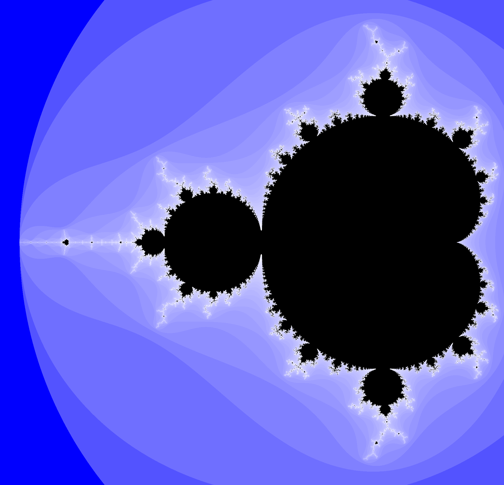
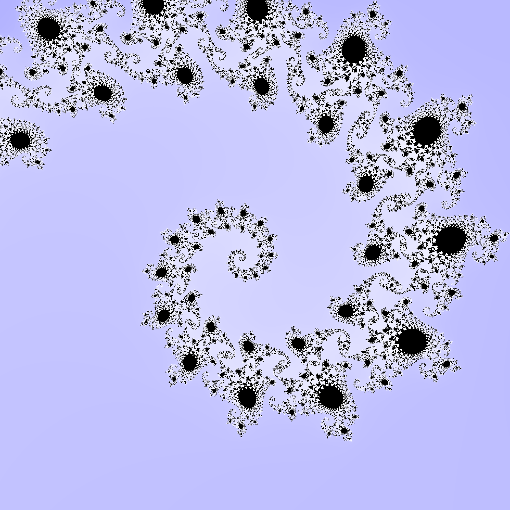
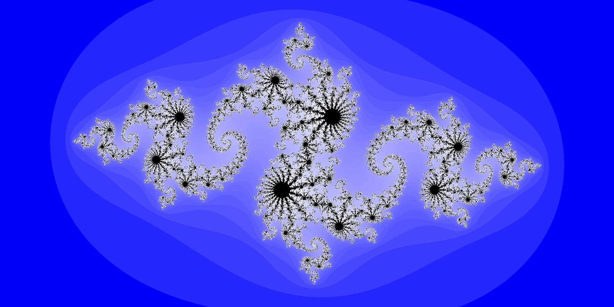

# MandelPlot : Mandelbrot and Julia Sets Image Generation Library

**This library can be used to visualize the Mandelbrot and Julia sets. It is able to generate and save high resolution images of any part of the Mandelbrot set as well as any part of any chosen Julia set.**
For more information about these sets, you visit their respective Wikipedia pages : [Mandelbrot Set](https://en.wikipedia.org/wiki/Mandelbrot_set) ; [Julia Set](https://en.wikipedia.org/wiki/Julia_set)

## Definitions of the Mandelbrot and Julia sets
The **Mandelbrot set** is the set of all complex numbers c such as the sequence z_n defined as : z_0 = 0 ; z_(n+1) = (z_n)^2 + c is bounded.

A **Julia set** for a specific complex c is a set containing every complex z_0 such as this same sequence z_n is bounded.

## How to use this library
You can install this library using `$ pip install .` after downloading the sources in your project folder.
It will automatically install all of the required external libraries it needs to function.

You can either use this library inside a python code with `import mandelPlot`, `import mandelPlot.julia`, or`import mandelPlot.mandelbrot`, or use it directly from the command line.

For command line use, you have access to two commands: `mandelPlot-mandelbrot` and `mandelPlot-julia` to respectively generate and save a figure from the Mandelbrot set and a Julia set.
Each of these commands allows to set different parameters (width of the image in pixels, maximum iteration, figure path...).
For a detailed description of these parameters, use the help with the `-h` option.

## Useful Information

 - The plotting function have default values, so you can have an example of values that work. 
The default values for the `plot_mandelbrot` function display the whole set. See below for these examples and others.
The default values for the `plot_julia` function display the whole set for $c=-0.8 + 0.156i$.
 
 - The plotting functions are equipped with a progress bar to keep track of the advancement of the generation. Don't be surprised if they slow down as they progress, it is due to the collapse of the parallel calculations.

## Visualisation examples
```python
>>> plot_mandelbrot()
```

```python
>>> plot_mandelbrot(zmin=-0.7440+0.1305j,
					zmax=-0.7425+0.1320j,
					width_pixel_number=2000, 
					max_iter=50, 
					fig_path="./mandelbrot_spiral_lowiter.png")
```

```python
>>> plot_mandelbrot(zmin=-0.7440+0.1305j,
					zmax=-0.7425+0.1320j,
					width_pixel_number=2000, 
					max_iter=200, 
					fig_path="./mandelbrot_spiral_mediumiter.png")
```

```python
>>> plot_mandelbrot(zmin=-0.7440+0.1305j,
					zmax=-0.7425+0.1320j,
					width_pixel_number=2000, 
					max_iter=500, 
					fig_path="./mandelbrot_spiral_highiter.png")
```

```python
>>> plot_mandelbrot(zmin=-0.7440+0.1305j,
					zmax=-0.7425+0.1320j,
					width_pixel_number=2000, 
					max_iter=1000, 
					fig_path="./mandelbrot_spiral_veryhighiter.png")
```

```python
>>> plot_julia()
```

```python
>>> plot_julia(width_pixel_number=2000, max_iter=50, fig_path="./julia_mediumiter.png")
```

```python
>>> plot_julia(width_pixel_number=2000, max_iter=500, fig_path="./julia_highiter.png")
```

```python
>>> plot_julia(width_pixel_number=2000, max_iter=1000, fig_path="./julia_veryhighiter.png")
```

